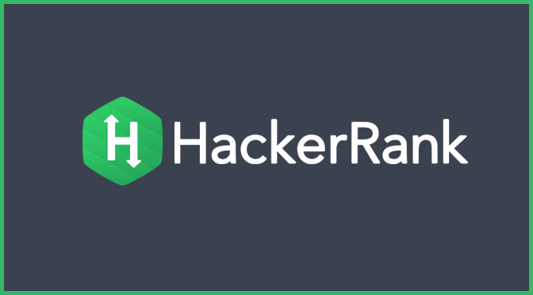

# Hacker Rank Solutions

My HackerRank profile: [@Ultirequiem](https://www.hackerrank.com/Ultirequiem)

## Verified Skills

- Python:
  - [Basic](https://www.hackerrank.com/certificates/74cb299c09d9)

## Badges

- Python ⭐⭐⭐ (3)

### LICENSE

[MIT](./LICENSE)

### Extras

Favorite Exercises: [UltiList](./python/easy/11_lists.py)
